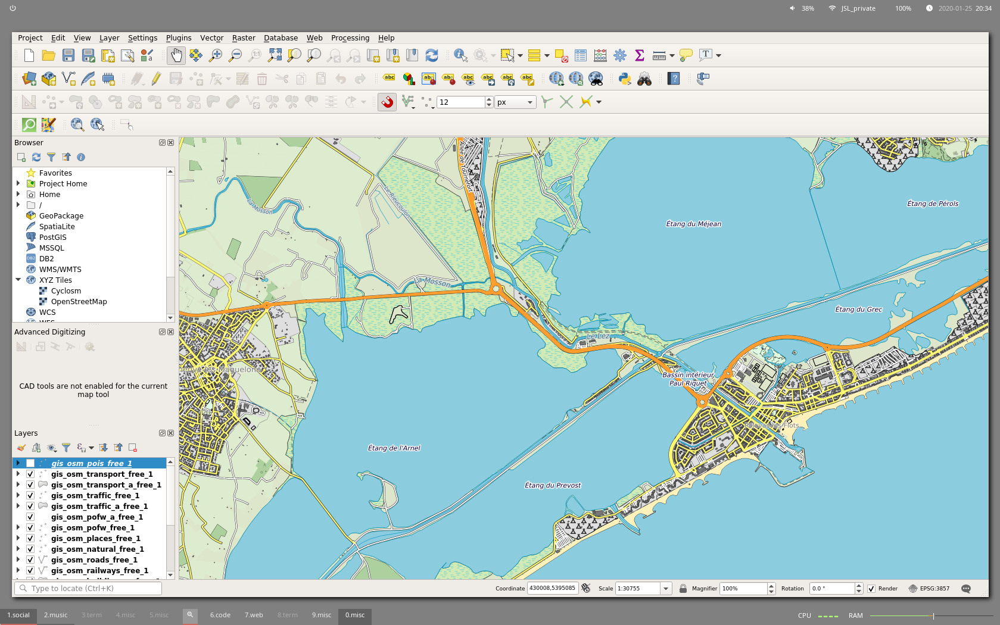

# qgis-starter-kit

## Inspired by

Styles
- [Styling the map](https://youtu.be/vPWmoxuAmJU) and [somes Steven Bernard videos](https://www.youtube.com/channel/UCrBM8Ka8HhDAYvQY1VX2P0w/videos)
- [Geofabrik QGIS style by champs-libres](https://gitlab.com/champs-libres/public/champs-libres-qgis-osm-style)

## Screenshot

Geofabrik style




## Downwload datas(one time)
```
##########################################################
# OSM datas (from geofrabrik)
##########################################################

# Download datas
mkdir -p ~/tmp/osm
REGIONS=("languedoc-roussillon" "midi-pyrenees" "provence-alpes-cote-d-azur" "rhone-alpes")

for REGION in $REGIONS; do
    test ! -f ~/tmp/osm/${REGION}.shp.zip && wget -O ~/tmp/osm/${REGION}.shp.zip "http://download.geofabrik.de/europe/france/${REGION}-latest-free.shp.zip"
done

# Unzip
for REGION in $REGIONS; do
    mkdir -p .datas/${REGION}
    test ! -f .datas/${REGION}/README && unzip ~/tmp/osm/${REGION}.shp.zip -d .datas/${REGION}
done

##########################################################
# Data gouv
##########################################################

wget -O ~/tmp/osm/regions-20180101-shp.zip https://www.data.gouv.fr/fr/datasets/r/aacf9338-8944-4513-a7b9-4cd7c2db2fa9
unzip  ~/tmp/osm/regions-20180101-shp.zip -d ".datas/"
```

## Launch QGIS from docker container
```
xhost +
docker run --rm --name="qgis-desktop-master" -it -w /tmp/ -v /root:/root -v ${HOME}:/home/${USER} -v /tmp/.X11-unix:/tmp/.X11-unix -e DISPLAY=unix$DISPLAY qgis/qgis:release-3_4 qgis
```
