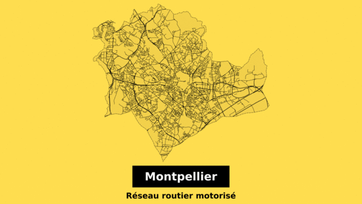
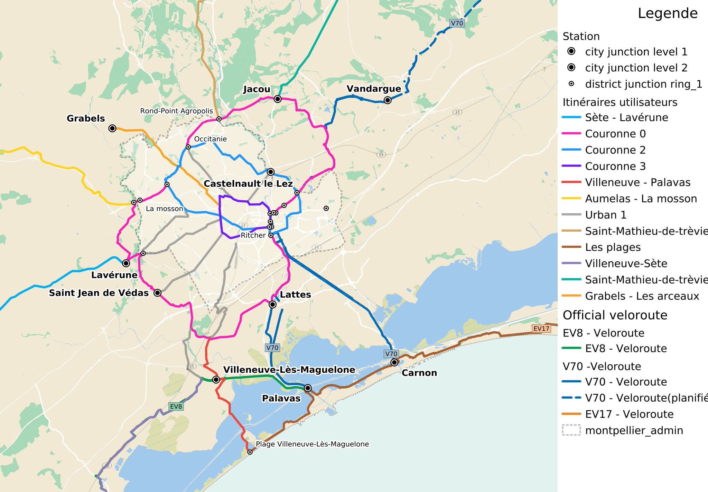
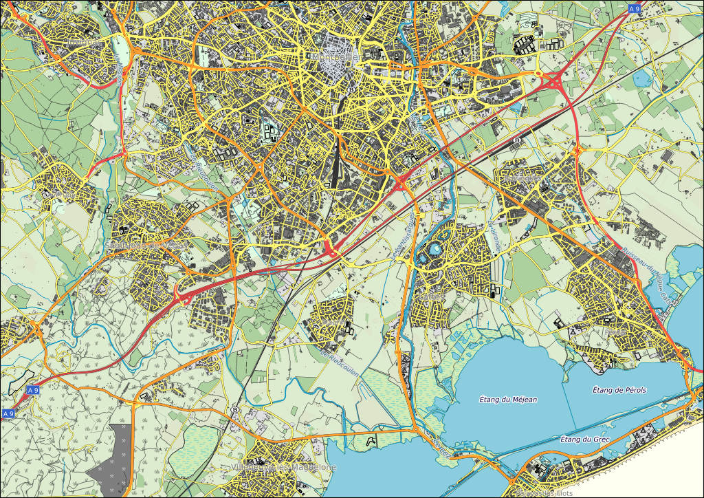

# qgis-starter-kit

## Inspired by

Styles
- [Styling the map](https://youtu.be/vPWmoxuAmJU) and [somes Steven Bernard videos](https://www.youtube.com/channel/UCrBM8Ka8HhDAYvQY1VX2P0w/videos)
- [Geofabrik QGIS style by champs-libres](https://gitlab.com/champs-libres/public/champs-libres-qgis-osm-style)

## Screenshot

Ways comparison style




Metro style




Geofabrik style (champs-libres-qgis-osm-style)




## Load or update datas
```
docker run --rm --name="qgis-desktop-master" -it -w /qgis-starter-kit -v /tmp:/tmp -v ${PWD}:/qgis-starter-kit  qgis/qgis:release-3_4 /qgis-starter-kit/init_datas.sh
```

## Launch QGIS from docker container
```
xhost +
docker run --rm --name="qgis-desktop-master" -it -w /qgis-starter-kit -v /root:/root -v ${HOME}:/home/${USER} -v /tmp/.X11-unix:/tmp/.X11-unix -e DISPLAY=unix$DISPLAY qgis/qgis:release-3_4 qgis
```
